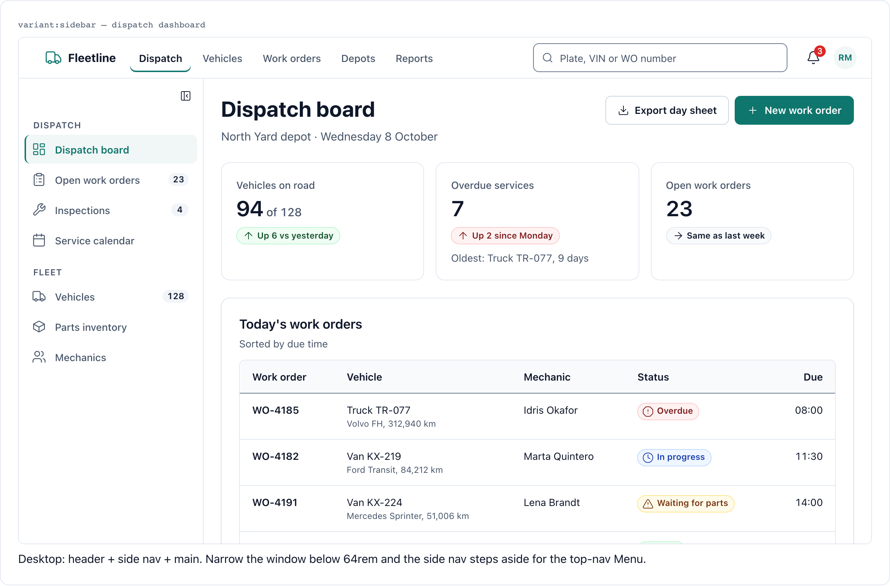
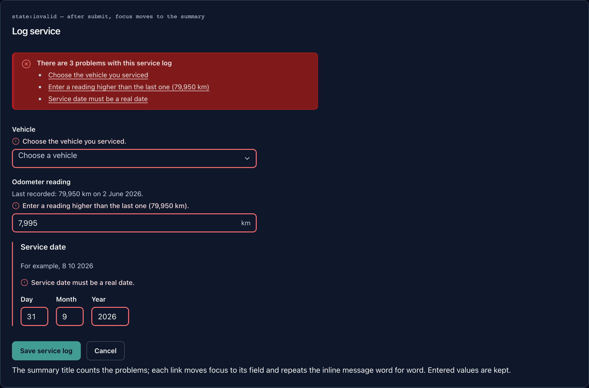
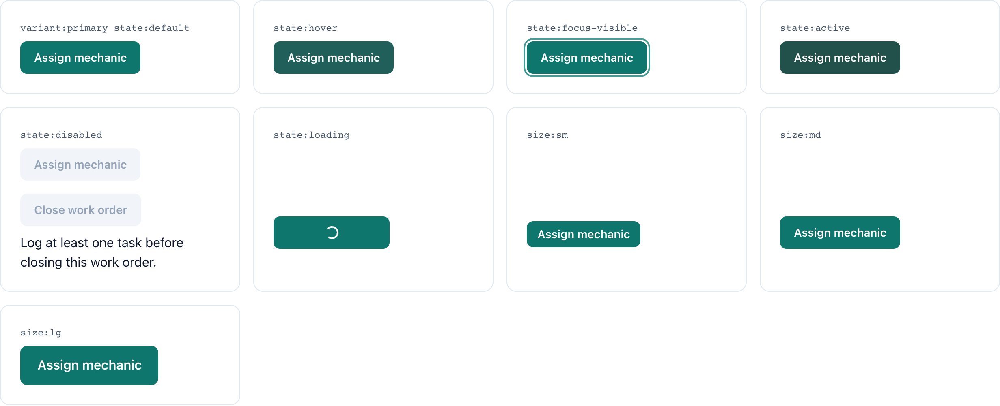
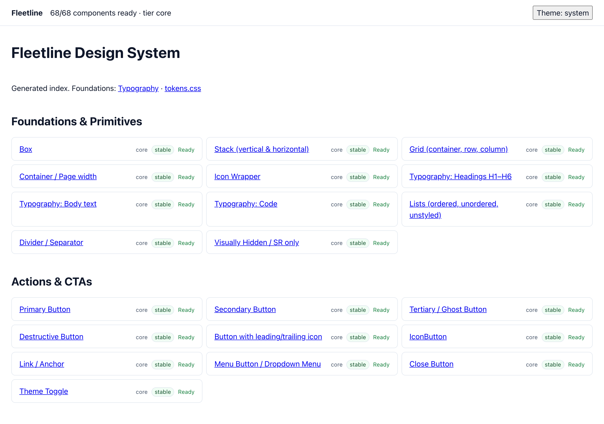
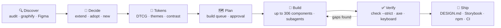
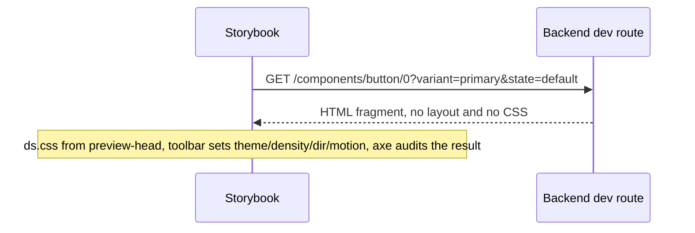

<div align="center">

# html-design-system

**An agent skill that turns your AI coding assistant into a design-system team.**

Decides *which* design system your product needs, then builds a *complete* one: DTCG tokens, up to 306 components (app UI plus opt-in **marketing**, **AI chat**, **commerce** and **email**), every state, docs, Storybook, `DESIGN.md`, `llms.txt`, an MCP server, npm package and CI — safely inside your existing project.

[](SKILL.md)
[](#component-coverage-306)
[](references/component-contract.md)
[](references/tokens.md)
[](#agents-can-query-your-system)
[](references/storybook.md)
[](scripts/ds.py)
[](https://github.com/AntonBronnfjell/tooling-agent-skill-markdown_html-design-system/actions/workflows/ci.yml)
[](LICENSE)
[](#install-as-a-plugin)
[](https://github.com/AntonBronnfjell/tooling-agent-skill-markdown_html-design-system/commits/main)

[Quick start](#quick-start) · [Example](#example-fleetline) · [How it works](#what-it-does-step-by-step) · [Existing projects](#safe-in-existing-projects) · [Your stack](#use-it-with-your-stack) · [Install](#install-any-agent) · [CLI](#cli-reference-scriptsdspy-python-38-no-dependencies) · [Limits](#known-limits)

</div>

<table>
<tr><td><b>Agents</b></td><td>Claude Code · Codex · Cursor · GitHub Copilot · Gemini CLI · Windsurf/Devin · Cline · Kiro · Roo Code · OpenCode · Amp · Goose · Junie · Continue</td></tr>
<tr><td><b>Stacks</b></td><td>Static HTML · React · Vue · Svelte · Angular · Web Components · Laravel · Symfony · Django · Flask/FastAPI · Rails · Spring · ASP.NET/Blazor · Phoenix · Go · Rust/WASM</td></tr>
</table>

> [!NOTE]
> The output is plain HTML, CSS and design tokens, so it works in any stack. Only the way components reach your app, and how you view them in isolation, changes per stack. See [Use it with your stack](#use-it-with-your-stack).

## Example: Fleetline

A complete **core-tier** design system built with this skill, using its own workflow and tools. It's a fleet-maintenance SaaS for dispatchers and mechanics, with a teal brand generated by `ds.py palette`.

- **68/68 core components and patterns:** every manifest variant and state, a docs page for each, and 15 progressive-enhancement JS modules.
- **Passing checks:** `ds.py check --strict`, `ds.py taste --strict` (100/100), and Google's DESIGN.md linter (0 errors, 0 warnings).
- **Accessibility:** axe and keyboard-focus checks pass on 211 of 212 page × theme combinations. The remaining one is an intermittent axe measurement on a static popover demo whose computed colors were verified correct.
- **Storybook:** 311 stories.

**[Open the live docs site →](https://antonbronnfjell.github.io/tooling-agent-skill-markdown_html-design-system/) · [Storybook →](https://antonbronnfjell.github.io/tooling-agent-skill-markdown_html-design-system/storybook/) · [Source](examples/fleetline)**

| Dispatch dashboard (app shell, light) | Log-service form, error state (dark) |
|---|---|
|  |  |

| Every button state, generated from the manifest | The catalog with live coverage and status |
|---|---|
|  |  |

## Why it exists

Ask an AI to "build a design system" and you usually get a dozen pretty components. The look is generic. Half the states are missing. Focus styles are broken. The dark mode is unreadable, and there's no way to tell what's missing. This skill fixes the two things that go wrong:

| Failure | How the skill prevents it |
|---|---|
| **Wrong direction**: the system doesn't fit the product, or ignores the design that already exists | An explicit decision phase. It inventories the existing code (`ds.py audit`, `/graphify`, Figma), then chooses to **extend** what exists, **adopt** a reference system (Carbon, Material 3, Fluent 2, Polaris, Atlassian, Spectrum, Primer, GOV.UK/USWDS, Radix/shadcn) or create a **new** direction (`/ui-ux-pro-max`). The choice is recorded as decision records and approved in plan mode before anything is built. |
| **Holes**: missing components, states, themes or accessibility | A machine-readable manifest of **306 components** (180 for app UI, plus 46 marketing, 29 AI, 31 commerce and 20 email), each listing the variants and states it must show. A CLI checks coverage, token validity, contrast in every theme and lint rules. Hooks re-check after every file the agent writes, and won't let it stop while the build is incomplete. |

## Quick start

> [!TIP]
> In Claude Code, the fastest route is the plugin: `/plugin marketplace add AntonBronnfjell/tooling-agent-skill-markdown_html-design-system` then `/plugin install html-design-system@anton-design`. For every other agent, the installer below detects what you have and puts the skill where each one looks for it.

```bash
# 1. Install into every agent on this machine
curl -fsSL https://raw.githubusercontent.com/AntonBronnfjell/tooling-agent-skill-markdown_html-design-system/main/install.sh | sh -s -- --tools all

# 2. In your project, ask your agent:
#    "Build a complete design system for <your product> in ./design-system"

# 3. Look at the result without touching your app
python3 ~/.agents/skills/html-design-system/scripts/ds.py serve ./design-system      # docs site
python3 ~/.agents/skills/html-design-system/scripts/ds.py storybook ./design-system  # then: cd design-system && npm i && npm run storybook
```

## What it does, step by step



1. **Discover.** It finds what already exists: CSS variables, Tailwind config, duplicate modals, Figma variables. `ds.py audit` counts distinct colors, spacings, fonts and radii, so "we have a system" and "we have 212 different grays" are easy to tell apart.
2. **Decide.** It picks extend, adopt or new (hybrids allowed), the tier (core, standard or enterprise), whether a marketing site is in scope, the motion personality, the fonts, and which surfaces each look is allowed on. Every choice is written to `ds.config.json` as a short decision record.
3. **Tokens.** It writes W3C-format design tokens in three tiers: raw values, intent-based tokens and per-component tokens. They come with light, dark and high-contrast themes, density and RTL support. Contrast is checked for every text/background pair in every theme.
4. **Plan.** It produces an ordered build queue (`ds.py plan`) and asks for approval in `/plan` mode before writing 100+ files.
5. **Build.** The agent builds a reference implementation first (typography, layout, button, form field, shared JS behaviors), then hands the remaining categories to parallel subagents. Each component gets CSS that uses only tokens, a docs page showing every variant and state, and, only when native HTML can't do the job, a small vanilla JS module.
6. **Verify.** `ds.py check --strict` must pass. Storybook runs axe on every story. Optional Playwright + axe tests cover every page in every theme. It also checks keyboard walkthroughs, RTL, 320px width and reduced motion.
7. **Ship.** It generates the `DESIGN.md` contract, a standalone Storybook, an npm package, a CI pipeline, a changelog with migration notes, and governance docs.

## What you get

```
design-system/
├── ds.config.json        brief, direction, tier, motion, principles, decision records, contrast pairs
├── tokens/               DTCG 2025.10: primitive · semantic · component · themes/ · scopes/ · resolver.json
├── dist/                 tokens.css · ds.css (bundle) · tokens.json · tokens.scss (media-query mixins)
├── css/                  base.css (reset, focus, sr-only, reduced motion) · components/*.css · patterns/*.css
├── js/                   theme.js (runtime + no-flash) · lib/* shared behaviors · <component>.js (init(root))
├── components/*.html     one docs page per component: usage · anatomy · live examples · accessibility · tokens
├── patterns/*.html       app shell, forms, dashboard, auth, settings, list/detail, wizard, feed, empty/error states,
│                         + landing, pricing, about, blog, article, legal, contact, waitlist pages (marketing scope)
├── index.html            catalog with live coverage
├── DESIGN.md             the contract in Google's DESIGN.md format (lints clean with npx @google/design.md)
├── ACCESSIBILITY.md      conformance statement template (EAA / EN 301 549, ADA Title II)
├── llms.txt, llms/       agent-readable docs: one Markdown page per component
├── mcp/server.py         MCP server: agents query components, tokens and rules
├── email/src → dist/email  email templates rendered with literal token values (email scope)
├── .storybook/ stories/  standalone Storybook (generated from the pages)
├── package.json          npm exports for CSS, tokens and JS
├── tools/ds/             vendored CLI so CI and teammates don't need the skill installed
└── .ds-owned.json        ownership ledger: what ds.py created (it never overwrites anything else)
```

### Component coverage (306)

**App UI (`product` scope, always on) — 180**

| Category | Count | Examples |
|---|---|---|
| Foundations & primitives | 20 | box, stack, cluster, grid, container, splitter, icon, type scale, highlight, code, kbd, prose, divider, image, scroll area |
| Actions | 19 | primary/secondary/ghost/destructive buttons, icon button, link, toggle, segmented control, split button, menu, overflow menu, selection action bar, FAB, theme toggle, copy, toolbar |
| Forms | 38 | field wrapper, text/password/search/number inputs, input mask, date field (memorable date), checkbox, radio, choice cards, switch, select, combobox, listbox, tree select, transfer list, upload, slider, date/time/range pickers, color picker, OTP, tag input, rating, attribute editor, code editor, rich-text shell, inline edit, composer, error summary |
| Navigation | 19 | top nav, side nav, app rail, app switcher, menubar, bottom nav, breadcrumbs, tabs, pagination, stepper, command palette, skip link, tree view, TOC, page/section headers, footer |
| Data display | 32 | table, data table, tree table, card, card collection, post card, sortable list, board, accordion, avatar, badge, tag, lists, comment thread, timeline, carousel, media stage, stat, formatters, QR code, chart container, legend, tooltip, axis, sparkline |
| Overlays | 12 | modal, alert dialog, drawer, side panel, floating panel, bottom sheet, popover, tooltip, toggletip, context menu, coachmark, lightbox |
| Feedback | 11 | alerts, callout, toast, progress, meter, spinner, skeleton, result panel, notification center |
| Patterns | 29 | app shell, form layout, dashboard, empty/error pages, auth, settings, list/detail, wizard, onboarding, feed, start page, question page, check answers, confirmation, task list, step-by-step, service unavailable, session timeout, exit quickly, address/name/phone/card entry, unsaved changes, create resource, delete with confirmation, saved filters |

**Opt-in scopes — 126**

| Scope | Count | Examples |
|---|---|---|
| `marketing` | 46 | hero (7 variants), marketing header, mega menu, logo cloud, feature grid/split, bento, stats, testimonials, pricing table, comparison table, FAQ, CTA band, newsletter, cookie consent, site footer · landing, pricing, legal, about, blog, article, contact, waitlist, changelog, careers, customer stories pages |
| `ai` | 29 | conversation, chat message, streaming response, reasoning, task steps, tool-call card, approval card, sources and citations, prompt input with model picker, suggestions, message actions, feedback, AI label and disclaimer, artifact panel, conversation history, context meter, MCP App widget shell · chat app, copilot panel, agent run pages |
| `commerce` | 31 | product card and gallery, price, variant picker, quantity stepper, stock and delivery, add to cart, mini cart, cart line, order summary, promo code, shipping and payment methods, address form, checkout steps, reviews, facets and sort · product list, product detail, cart, checkout, order confirmation, account orders pages |
| `email` | 20 | email shell, header, hero, bulletproof button, text, image, columns, product row, receipt, social, footer with unsubscribe, OTP · verify, password reset, receipt, invite, newsletter, digest templates |

> [!TIP]
> **Tiers:** across app UI, **core** has 68 components (what every product needs), **standard** adds 70 and **enterprise** adds 42. Ask for "complete" and you get enterprise.
>
> **Scopes:** add them with `ds.py init --scopes product,marketing,ai,commerce,email` (any subset). Each brings its own specs and rules: landing-page performance, SEO and honest consent for `marketing`; streaming accessibility, AI labelling and human-in-the-loop approvals for `ai`; Baymard checkout rules for `commerce`; table layouts, dark-mode quirks and client checks for `email`.

### What "done" means for each component

- A docs page that shows **every** variant, size and state in the manifest: hover, focus-visible, active, disabled, loading, invalid, read-only, selected, open/closed, empty, error. The CLI checks every one.
- CSS that uses only tokens. It uses logical properties (so RTL works), supports forced colors, respects reduced motion, has hit targets of at least 24px, and never removes focus outlines.
- Native HTML first: `<dialog>`, the `popover` attribute, `<details>` and native inputs. JS is added only where the platform falls short, and follows the WAI-ARIA keyboard patterns.
- Accessibility to WCAG 2.2 AA. Every page documents the roles, keyboard table, focus management and screen-reader announcements.
- A framework version, when you ask for React/Vue/Svelte/Angular/Web Components. It renders the same markup, follows the component layers and API conventions, and is built test → component → story.

## Safe in existing projects

Point it at a project that already has code and it adapts instead of taking over:

```bash
ds.py detect .                                          # reads the stack, monorepo, styles, Storybook, CI — writes nothing
ds.py init design-system --project . --dry-run          # shows every file it would create
ds.py init design-system --project .                    # then for real
```

- **Detects the stack:** Laravel, Symfony, WordPress, Django, Flask/FastAPI, Rails, Phoenix, ASP.NET, Spring, Go, Next, Nuxt, Astro, SvelteKit, Angular, Vite (React/Vue/Svelte), Hugo and Jekyll, plus monorepo workspaces (npm, yarn, pnpm, bun). It reports existing Tailwind/shadcn/Sass setups, token or theme files, Storybook and CI.
- **One self-contained folder** at a location that fits the project (`packages/design-system` in a monorepo, `resources/design-system` in Laravel, …), never inside your source folders. An occupied folder is refused unless you pass `--adopt`.
- **Never overwrites your files.** An ownership ledger (`.ds-owned.json`) records what `ds.py` created. Anything else, or anything you edited afterwards, is kept; the only override is `--force-all`. Every command accepts `--dry-run`.
- **Doesn't edit project files.** For your `package.json`, `.gitignore`, `.gitlab-ci.yml` or an existing `.storybook/`, it prints the exact snippet to merge instead: workspace dependency, GitLab `include:`, Storybook `refs`.
- **Plugs into your conventions.** `ds.py sync` copies the built CSS, tokens and `theme.js` into the folders your framework expects (`resources/css`, `static/`, `wwwroot/css`, `src/styles`, …), automatically after each build.

## Agents can query your system

Every system it builds is readable by other AI tools, not just people:

- **`DESIGN.md`** follows Google's [DESIGN.md format](https://github.com/google-labs-code/design.md). The token front matter plus ordered sections lint clean with `npx @google/design.md lint`.
- **`ds.py llms`** writes `llms.txt`, `llms-full.txt` and one Markdown page per component (usage, anatomy, every state as HTML, accessibility, tokens).
- **`ds.py mcp`** generates an MCP server with no dependencies. Claude, Cursor, VS Code, Codex or any MCP client can list and search components, read their docs, and fetch tokens per theme:

  ```bash
  claude mcp add design-system -- python3 design-system/mcp/server.py
  ```

## Generate, export and check

| Command | What you get |
|---|---|
| `ds.py palette '#0f766e' --name teal --dir ds --primary` | An 11-step OKLCH ramp from one brand color. Primary, link, focus and selected are mapped to the steps that measurably pass contrast in light, dark and high-contrast. Add `--brand acme` for white-label brands; every brand × theme is contrast-checked |
| `ds.py scale type --dir ds` · `scale space` | Fluid type and space scales (Utopia formulas) as `clamp()` tokens that still respect browser zoom |
| `ds.py export ds --target all` | Tailwind v4 `@theme`, shadcn/ui variables, Figma Variables (API body with real aliases + DTCG per mode), SwiftUI/UIKit, Android XML, Jetpack Compose and Flutter — no Style Dictionary needed ([adapters](references/adapters.md)) |
| `ds.py icons ./svg ds` | An optimized SVG sprite (`currentColor`) and an icon gallery page |
| `ds.py audit --url https://your-site.com` | The de-facto design system of a live site, with suggested primitive tokens |
| `ds.py taste ds --strict` | Fails on the generic "AI look": purple gradients, glassmorphism, buzzwords, emoji UI, placeholder copy, vague CTAs ([rules](references/taste.md)) |
| `ds.py playwright ds` | A free visual-regression + axe + keyboard-focus suite for every page × theme × desktop/mobile + RTL |

## See it independently of your app

| Option | Command | Best for |
|---|---|---|
| Docs site | `ds.py serve design-system` → http://127.0.0.1:8000 | Zero dependencies. Theme, density, RTL and motion toggles on every page |
| Storybook (HTML) | `ds.py storybook design-system && cd design-system && npm i && npm run storybook` | One story per demo state, a live token catalog, the same toolbar, axe on every story, a static build you can deploy |
| Storybook (frameworks) | see `references/storybook.md` | React, Vue, Svelte, Angular and Web Components adapters, with the same categories, toolbar and a11y gate |
| Storybook (backend templates) | `ds.py storybook design-system --renderer server` | `@storybook/server`: each story fetches HTML from a backend, so Laravel, Symfony, Django, Flask, Rails, Spring, ASP.NET or Phoenix render their own templates. `ds.py serve` answers as the reference backend, and its fragments are the contract the templates must match |
| Native workbenches | see `references/storybook.md` §4 | Lookbook (Rails), Blast (Laravel), django-pattern-library + storybook-django, Blazing Story (Blazor), web components for multi-stack or WASM (Rust) |
| Alternatives | see `references/storybook.md` | Histoire, Ladle, Pattern Lab, Fractal |

`ds.py ci --provider github` deploys the Storybook to GitHub Pages on every merge. GitLab gets the equivalent through `--provider gitlab`.

## Use it with your stack

The system itself is stack-neutral: `dist/ds.css`, tokens, and HTML markup conventions. What changes per stack is how the components get into your app and how you view them in isolation.

| Your stack | How components reach your app | How to view them in isolation |
|---|---|---|
| Static HTML / any site | `<link href="dist/ds.css">` + the documented markup | Docs site (`ds.py serve`) or generated Storybook (`ds.py storybook`) |
| React, Vue, Svelte, Angular | Thin wrappers emitting the same markup and classes; layers, API conventions and test → component → story order are in `references/component-contract.md` §7 | That framework's Storybook (`@storybook/react-vite`, `vue3-vite`, …) using the same toolbar and categories |
| Several stacks share one system | Web components (Lit or vanilla) for behavior, `ds.css` for styling, one bundle via npm or a CDN | `@storybook/web-components-vite` |
| Laravel, Symfony (Blade, Twig) | Blade/Twig partials that emit the reference markup | Blast (Laravel), or `ds.py storybook --renderer server` with a dev-only route |
| Django, Flask, FastAPI (templates, Jinja2) | Template partials or django-components | django-pattern-library + storybook-django, or `--renderer server` |
| Rails (ViewComponent, Phlex, partials) | Components that emit the reference markup | Lookbook, or `view_component_storybook` → `--renderer server` |
| Spring Boot (Thymeleaf) | Thymeleaf fragments | `--renderer server` with a `@Profile("dev")` controller |
| ASP.NET Core (Razor, Blazor) | Razor partials or Blazor components | Blazing Story (Blazor), or `--renderer server` (Razor Pages/MVC) |
| Phoenix, Go templates | Function components / templates | `--renderer server` |
| Rust (Leptos, Yew, Dioxus) | WASM exposed as custom elements | Web Components Storybook |

<details>
<summary><b>How server mode works</b> (Storybook for backend templates)</summary>

<br/>

`ds.py storybook --renderer server` builds a Storybook in which every story asks a backend for its HTML (`GET <url>/<components|patterns>/<file>/<n>?variant=…&state=…`). Out of the box, `ds.py serve` answers those requests with the reference markup from the component pages, so you can use it immediately. Then you point `STORYBOOK_SERVER_URL` at your app's dev-only route, and your real templates render in the same Storybook. The theme, density, direction and motion toggles and the accessibility checks still work. The reference HTML is the contract your templates must match. Route sketches for each framework are in `references/storybook.md` §4.



</details>

## Using it

After installing, just ask:

- "Build a complete design system for our fleet-maintenance SaaS: dispatchers and mechanics, desktop and tablet."
- "Our CSS in `./src/styles` is a mess. Turn it into a real design system, core tier, keep our teal brand."
- "Should we adopt Carbon or Polaris for our finance admin tool? Set up the tokens and plan, but don't build yet."
- "Finish the design system in `./design-system` and give me a Storybook and an npm package."
- "We're launching next month. Add the marketing components: hero, pricing, testimonials, FAQ, footer, and a landing page and pricing page built from them."
- "We're a Laravel shop. Build the system, port the components to Blade, and set up a Storybook that renders our Blade partials."
- "Our apps use React and .NET. Make the components shareable across both and document them in one place."

In Claude Code you can also call it directly: `/html-design-system new enterprise`, `/html-design-system extend ./src`, `/html-design-system resume`.

## Install as a plugin

| Agent | How |
|---|---|
| **Claude Code** | `/plugin marketplace add AntonBronnfjell/tooling-agent-skill-markdown_html-design-system` → `/plugin install html-design-system@anton-design`. Adds the skill, its scoped hooks and five commands: `/html-design-system:new`, `:extend`, `:adopt`, `:audit`, `:resume` |
| **Codex** | `codex plugin marketplace add AntonBronnfjell/tooling-agent-skill-markdown_html-design-system` (reads `.agents/plugins/marketplace.json` and `.codex-plugin/plugin.json`) |
| **Cursor** | The repo carries `.cursor-plugin/plugin.json` and a root `SKILL.md`, so it can be added as a plugin from its Git URL, or submitted to the Cursor marketplace |
| **Anything else** | The installer below (shared `~/.agents/skills` standard + agent-specific folders) |

Plugins update when the version in `.claude-plugin/plugin.json` changes; see [CHANGELOG.md](CHANGELOG.md).

## Install (any agent)

Requires Python 3.8+ (the skill's own scripts use it too). From a clone (`git clone https://github.com/AntonBronnfjell/tooling-agent-skill-markdown_html-design-system.git`):

```bash
./install.sh                    # macOS / Linux — auto-detects installed agents
.\install.ps1                   # Windows PowerShell
python3 install.py --list       # see every supported agent, its path and status
```

| Option | Effect |
|---|---|
| `--tools all` / `--tools claude,cursor,kiro` | all known agents / a specific set (default `auto` = detected ones) |
| `--project <dir>` | install into a repo (`.claude/skills`, `.agents/skills`, …) so the team gets it on clone |
| `--link` | dev mode: Claude Code symlinks to this repo, so edits are live |
| `--claude-hooks` | also register the lint/coverage hooks in Claude `settings.json` (always-on; see below) |
| `--uninstall` | remove everything the installer created (only its own files and hooks) |
| `--dry-run` | preview |

Without cloning:

```bash
curl -fsSL https://raw.githubusercontent.com/AntonBronnfjell/tooling-agent-skill-markdown_html-design-system/main/install.sh | sh -s -- --tools all
```

```powershell
irm https://raw.githubusercontent.com/AntonBronnfjell/tooling-agent-skill-markdown_html-design-system/main/install.ps1 | iex
```

<details>
<summary><b>Where it goes</b> (per-agent install paths)</summary>

| Agent | User-level location | Project-level | Notes |
|---|---|---|---|
| Claude Code | `~/.claude/skills/html-design-system` | `.claude/skills/` | Full SKILL.md: scoped hooks, `argument-hint`, live status |
| Codex, Cursor, Gemini CLI, GitHub Copilot, Windsurf/Devin, OpenCode, Amp, Goose, Junie | `~/.agents/skills/html-design-system` (shared standard) | `.agents/skills/` (Copilot, Cline, OpenCode, Amp, Goose also read project `.claude/skills/`) | Portable SKILL.md: Claude-only frontmatter keys removed for strict agentskills.io validators |
| Kiro · Roo Code · Cline | `~/.kiro/skills` · `~/.roo/skills` · `~/.cline/skills` | `.kiro/` · `.roo/` · `.cline/skills` | Symlink to the shared copy (copy on Windows without Developer Mode) |
| Continue | `~/.continue/rules/html-design-system.md` | `.continue/rules/` | Rule that points the agent at the skill |
| Aider | — | — | No skill support: installer prints the `read:` line for `.aider.conf.yml` |

Agents that read `~/.agents/skills` don't get a second copy in their own folder by default, which would list the skill twice. You can force one with `--tools cursor,copilot,gemini,windsurf,devin,opencode,junie,codex`.

</details>

### Hooks

> [!IMPORTANT]
> **Gating.** both hooks stay silent outside a design system (no `ds.config.json`). The Stop gate only acts during the `build` phase. Soften it with `"gate": "warn"` or `"off"` in `ds.config.json`.

- **Claude Code:** the hooks are declared in SKILL.md and run only while the skill is active.
- **Always-on hooks:** `--claude-hooks` adds them to `~/.claude/settings.json`, or to the project's settings with `--project`. Don't combine it with the skill-scoped hooks unless you're fine with each check running twice while the skill is active.
- **Other agents:** their hook formats differ and aren't installed. SKILL.md tells those agents to run `ds.py check` after each file and `ds.py coverage` before ending a turn. `hooks/settings.example.json` is a manual Claude snippet.

## Companion skills

When these skills are installed, it uses them. All are optional, with fallbacks documented in [`references/companion-skills.md`](references/companion-skills.md).

| Skill | Used for |
|---|---|
| `/graphify` | Discovering existing code; the final component ↔ token map |
| `/ui-ux-pro-max` | Style, palette, font pairing, UX rules |
| `/plan` | Approval before building 100+ files |
| `/ponytail` | Native-first, minimal implementation |
| `/ui-styling` | Tailwind and shadcn adapters |

## CLI reference (`scripts/ds.py`, Python 3.8+, no dependencies)

<details>
<summary>Show all commands</summary>

```bash
DS="python3 scripts/ds.py"
$DS detect .                             # read an existing project; propose location + sync targets (writes nothing)
$DS audit ./src                          # inventory an existing codebase's de-facto design system
$DS audit --url https://example.com      # …or a live site (page + stylesheets), with suggested tokens
$DS init ./design-system --name Acme --tier enterprise --scopes product,marketing --project .
$DS sync ./design-system                 # copy outputs into the app's own folders (also runs after build)
$DS migrate-colors ./design-system       # legacy hex tokens → DTCG 2025.10 color objects
$DS palette '#0f766e' --name teal --dir ./design-system --primary   # OKLCH ramp + contrast-checked mapping
$DS palette '#c2410c' --name blue --dir ./design-system --brand ember  # white-label brand override
$DS scale type --dir ./design-system     # fluid type scale (also: scale space)
$DS export ./design-system --target all  # tailwind, shadcn, figma, ios, android, compose, flutter
$DS icons ./svg ./design-system          # SVG sprite + icon gallery
$DS build ./design-system                # tokens.css/json/scss, ds.css bundle, index.html
$DS check ./design-system --strict       # token validity, contrast in every theme, lint, coverage
$DS coverage ./design-system             # per component: which demos/doc sections/CSS are missing
$DS plan ./design-system                 # ordered build queue grouped by file
$DS phase ./design-system build          # discover | decide | plan | build | done (drives the Stop gate)
$DS serve ./design-system                # preview at http://127.0.0.1:8000
$DS storybook ./design-system            # generate the standalone Storybook (--renderer server for backend templates)
$DS design-md ./design-system            # DESIGN.md (Google format) + ACCESSIBILITY.md
$DS llms ./design-system                 # llms.txt + Markdown per component + dist/ds-index.json
$DS mcp ./design-system                  # MCP server for agents
$DS email ./design-system                # render + check email templates (email scope)
$DS playwright ./design-system           # visual regression + axe + keyboard focus suite
$DS taste ./design-system --strict       # generic-AI-look linter
$DS package ./design-system              # npm-ready package.json
$DS ci ./design-system --provider github # pipeline + vendored tools
$DS status                               # one-line state of the nearest design system
# global: --dry-run (preview every write) · --force-all (overwrite even files you edited)
```

</details>

## Repository layout

<details>
<summary>Show the repository tree</summary>

```
./  (repo root = skill root)
├── SKILL.md                     the workflow the agent follows, plus scoped Claude Code hooks
├── .claude-plugin/              plugin.json (5 commands, evals dir) + marketplace.json — Claude Code plugin
├── .cursor-plugin/ .codex-plugin/ .agents/plugins/   Cursor and Codex plugin manifests
├── assets/
│   ├── manifest.json            306 components · 16 categories · 3 tiers · 5 scopes
│   └── templates/               DTCG tokens + themes, config, base.css, theme.js, docs chrome, page template,
│                                storybook/ (client: main, preview, render · server: main, preview, preview-head),
│                                ci/ (GitHub Actions, GitLab CI), scopes/ (ai tokens, email starter), mcp_server.py
├── scripts/ds.py                the CLI above + hook entry points
├── references/                  decision guide · tokens · component contract · per-category specs · motion ·
│                                css-architecture · conventions · performance · storybook · testing · packaging ·
│                                governance · email-build · adapters · content · imagery · taste · companion skills ·
│                                builder brief
├── hooks/settings.example.json  manual Claude hook snippet (install.py --claude-hooks does this for you)
├── examples/fleetline/          a complete core-tier design system built with this skill (live on GitHub Pages)
├── tests/                       stdlib unit tests + golden outputs (python3 -m unittest discover -s tests)
├── plugin-evals/                `claude plugin eval` cases (trigger, safety, negatives)
├── evals/                       skill-creator test prompts + fixture
├── .github/workflows/           ci.yml (tests on 3.8–3.14 × Linux/macOS/Windows, plugin validation, DESIGN.md lint),
│                                pages.yml (publishes the example)
├── LICENSE · CHANGELOG.md · SECURITY.md · CONTRIBUTING.md
└── install.py / .sh / .ps1      cross-agent installer
```

</details>

## Known limits

> [!WARNING]
> - Framework Storybooks (React, Vue and others) are documented with conventions and examples, but not generated. Only the HTML system's Storybook is generated, in client or server mode.
> - The backend route sketches in `references/storybook.md` are outlines. Server mode has been tested end to end against the reference backend (`ds.py serve`), not against real Laravel, Django or Rails apps.
> - The generated CI files for *your* design system (`ds.py ci`) are templates that haven't been run on every provider; this repo's own CI runs on every push.
> - Plugin eval cases that need Bash or Write must run where Claude Code's sandbox works (CI, Linux with bubblewrap, macOS without symlinks in `~/.docker`). The negative cases pass locally.
> - `ds.py icons` does light optimization (metadata, editor attributes, precision, `currentColor`); it isn't a full SVGO.
> - Figma Variables export targets the REST API body; posting it needs an Enterprise full seat, and re-posting creates duplicates.
> - The example system implements the **core tier** of app UI. The other tiers and the AI, commerce, marketing and email scopes are specified (a spec for every component) but have no reference implementation yet; `ds.py email` ships one starter template.
> - Stack detection uses file conventions (e.g. `artisan`, `manage.py`, `angular.json`). Unusual layouts may need the `project.sync` targets in `ds.config.json` adjusted by hand.
> - Hooks are installed for Claude Code only. Other agents run `ds.py check` and `ds.py coverage` manually, as `SKILL.md` instructs.

<div align="right"><a href="#html-design-system">↑ Back to top</a></div>
