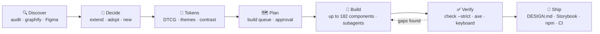
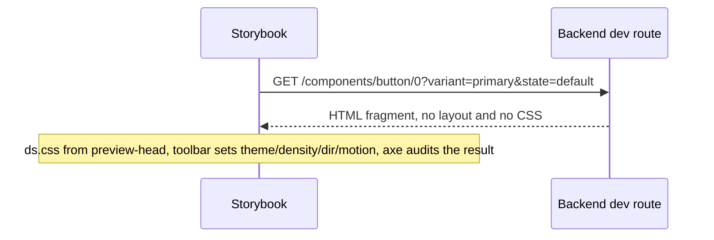

<div align="center">

# html-design-system

**An agent skill that turns your AI coding assistant into a design-system team.**

Decides *which* design system your product needs, then builds a *complete* one: tokens, up to 182 components (app UI **and** landing-page sections), every state, docs, Storybook, `DESIGN.md`, npm package and CI.

[](SKILL.md)
[](#component-coverage-182)
[](references/component-contract.md)
[](references/tokens.md)
[](references/storybook.md)
[](scripts/ds.py)
[](https://github.com/AntonBronnfjell/tooling-agent-skill-markdown_html-design-system/commits/main)

[Quick start](#quick-start) · [How it works](#what-it-does-step-by-step) · [Your stack](#use-it-with-your-stack) · [Install](#install-any-agent) · [CLI](#cli-reference-scriptsdspy-python-38-no-dependencies) · [Limits](#known-limits)

</div>

<table>
<tr><td><b>Agents</b></td><td>Claude Code · Codex · Cursor · GitHub Copilot · Gemini CLI · Windsurf/Devin · Cline · Kiro · Roo Code · OpenCode · Amp · Goose · Junie · Continue</td></tr>
<tr><td><b>Stacks</b></td><td>Static HTML · React · Vue · Svelte · Angular · Web Components · Laravel · Symfony · Django · Flask/FastAPI · Rails · Spring · ASP.NET/Blazor · Phoenix · Go · Rust/WASM</td></tr>
</table>

> [!NOTE]
> The output is plain HTML, CSS and design tokens, so it works in any stack. Only the way components reach your app, and how you view them in isolation, changes per stack. See [Use it with your stack](#use-it-with-your-stack).

## Why it exists

Ask an AI to "build a design system" and you usually get a dozen pretty components. The look is generic. Half the states are missing. Focus styles are broken. The dark mode is unreadable, and there's no way to tell what's missing. This skill fixes the two things that go wrong:

| Failure | How the skill prevents it |
|---|---|
| **Wrong direction**: the system doesn't fit the product, or ignores the design that already exists | An explicit decision phase. It inventories the existing code (`ds.py audit`, `/graphify`, Figma), then chooses to **extend** what exists, **adopt** a reference system (Carbon, Material 3, Fluent 2, Polaris, Atlassian, Spectrum, Primer, GOV.UK/USWDS, Radix/shadcn) or create a **new** direction (`/ui-ux-pro-max`). The choice is recorded as decision records and approved in plan mode before anything is built. |
| **Holes**: missing components, states, themes or accessibility | A machine-readable manifest of **182 components** (136 for app UI, 46 for marketing sites), each listing the variants and states it must show. A CLI checks coverage, token validity, contrast in every theme and lint rules. Hooks re-check after every file the agent writes, and won't let it stop while the build is incomplete. |

## Quick start

> [!TIP]
> No clone needed. The installer detects which agents you have and puts the skill where each one looks for it.

```bash
# 1. Install into every agent on this machine
curl -fsSL https://raw.githubusercontent.com/AntonBronnfjell/tooling-agent-skill-markdown_html-design-system/main/install.sh | sh -s -- --tools all

# 2. In your project, ask your agent:
#    "Build a complete design system for <your product> in ./design-system"

# 3. Look at the result without touching your app
python3 ~/.agents/skills/html-design-system/scripts/ds.py serve ./design-system      # docs site
python3 ~/.agents/skills/html-design-system/scripts/ds.py storybook ./design-system  # then: cd design-system && npm i && npm run storybook
```

## What it does, step by step



1. **Discover.** It finds what already exists: CSS variables, Tailwind config, duplicate modals, Figma variables. `ds.py audit` counts distinct colors, spacings, fonts and radii, so "we have a system" and "we have 212 different grays" are easy to tell apart.
2. **Decide.** It picks extend, adopt or new (hybrids allowed), the tier (core, standard or enterprise), whether a marketing site is in scope, the motion personality, the fonts, and which surfaces each look is allowed on. Every choice is written to `ds.config.json` as a short decision record.
3. **Tokens.** It writes W3C-format design tokens in three tiers: raw values, intent-based tokens and per-component tokens. They come with light, dark and high-contrast themes, density and RTL support. Contrast is checked for every text/background pair in every theme.
4. **Plan.** It produces an ordered build queue (`ds.py plan`) and asks for approval in `/plan` mode before writing 100+ files.
5. **Build.** The agent builds a reference implementation first (typography, layout, button, form field, shared JS behaviors), then hands the remaining categories to parallel subagents. Each component gets CSS that uses only tokens, a docs page showing every variant and state, and, only when native HTML can't do the job, a small vanilla JS module.
6. **Verify.** `ds.py check --strict` must pass. Storybook runs axe on every story. Optional Playwright + axe tests cover every page in every theme. It also checks keyboard walkthroughs, RTL, 320px width and reduced motion.
7. **Ship.** It generates the `DESIGN.md` contract, a standalone Storybook, an npm package, a CI pipeline, a changelog with migration notes, and governance docs.

## What you get

```
design-system/
├── ds.config.json        brief, direction, tier, motion, principles, decision records, contrast pairs
├── tokens/               DTCG: primitive · semantic · component · themes/{dark,high-contrast} · components/*
├── dist/                 tokens.css · ds.css (bundle) · tokens.json · tokens.scss (media-query mixins)
├── css/                  base.css (reset, focus, sr-only, reduced motion) · components/*.css · patterns/*.css
├── js/                   theme.js (runtime + no-flash) · lib/* shared behaviors · <component>.js (init(root))
├── components/*.html     one docs page per component: usage · anatomy · live examples · accessibility · tokens
├── patterns/*.html       app shell, forms, dashboard, auth, settings, list/detail, wizard, feed, empty/error states,
│                         + landing, pricing, about, blog, article, legal, contact, waitlist pages (marketing scope)
├── index.html            catalog with live coverage
├── DESIGN.md             the one-file contract for humans and AI agents
├── .storybook/ stories/  standalone Storybook (generated from the pages)
├── package.json          npm exports for CSS, tokens and JS
└── tools/ds/             vendored CLI so CI and teammates don't need the skill installed
```

### Component coverage (182)

| Category | Count | Examples |
|---|---|---|
| Foundations & primitives | 18 | box, stack, cluster, grid, container, icon, type scale, code, kbd, prose, divider, image, scroll area |
| Actions | 17 | primary/secondary/ghost/destructive buttons, icon button, link, toggle, segmented control, split button, menu, FAB, theme toggle, copy, toolbar |
| Forms | 32 | field wrapper, text/password/search/number inputs, checkbox, radio, switch, select, combobox, listbox, transfer list, upload, slider, date/time/range pickers, color picker, OTP, tag input, rating, rich-text shell, inline edit, composer, error summary |
| Navigation | 17 | top nav, side nav, app rail, bottom nav, breadcrumbs, tabs, pagination, stepper, command palette, skip link, tree view, TOC, page/section headers, footer |
| Data display | 21 | table, data table (sort/filter/select/bulk), tree table, card, post card, accordion, avatar, badge, tag, lists, timeline, carousel, media stage, stat, chart container, hover card |
| Overlays | 9 | modal, alert dialog, drawer, bottom sheet, popover, tooltip, context menu, coachmark, lightbox |
| Feedback | 10 | inline/global alerts, callout, toast, progress, meter, spinner, skeleton, notification center |
| Patterns | 12 | app shell, form layout, dashboard, empty state, error pages, auth, settings, list/detail, detail page, wizard, onboarding, feed |
| **Marketing sections** | 35 | announcement bar, marketing header, mega menu, hero (centered, split, email capture, video, product shot), logo cloud, feature grid/split, bento grid, stats band, steps, testimonials, press, trust badges, rating summary, pricing table, comparison table, CTA band, newsletter, waitlist, countdown, FAQ, blog cards, content section, team, contact, integrations, video, gallery, roadmap, changelog, app-store badges, cookie consent, locale switcher, sticky CTA, site footer |
| **Marketing pages** | 11 | landing, pricing, legal (privacy/terms), about, blog index, blog article, contact, waitlist/coming soon, changelog, careers, customer stories |

> [!TIP]
> **Tiers:** **core** has 65 components (what every product needs), **standard** adds 44 for a typical product suite, and **enterprise** adds the last 27. Ask for "complete" and you get enterprise.
>
> **Scopes:** app UI (`product`) is always on. Add `marketing` when there's a public website (`ds.py init --scopes product,marketing`). That adds 46 sections and pages (16 core, 20 standard, 10 enterprise), with landing-page rules for LCP performance, SEO metadata and structured data, honest consent, and a single `<h1>`.

### What "done" means for each component

- A docs page that shows **every** variant, size and state in the manifest: hover, focus-visible, active, disabled, loading, invalid, read-only, selected, open/closed, empty, error. The CLI checks every one.
- CSS that uses only tokens. It uses logical properties (so RTL works), supports forced colors, respects reduced motion, has hit targets of at least 24px, and never removes focus outlines.
- Native HTML first: `<dialog>`, the `popover` attribute, `<details>` and native inputs. JS is added only where the platform falls short, and follows the WAI-ARIA keyboard patterns.
- Accessibility to WCAG 2.2 AA. Every page documents the roles, keyboard table, focus management and screen-reader announcements.
- A framework version, when you ask for React/Vue/Svelte/Angular/Web Components. It renders the same markup, follows the component layers and API conventions, and is built test → component → story.

## See it independently of your app

| Option | Command | Best for |
|---|---|---|
| Docs site | `ds.py serve design-system` → http://127.0.0.1:8000 | Zero dependencies. Theme, density, RTL and motion toggles on every page |
| Storybook (HTML) | `ds.py storybook design-system && cd design-system && npm i && npm run storybook` | One story per demo state, a live token catalog, the same toolbar, axe on every story, a static build you can deploy |
| Storybook (frameworks) | see `references/storybook.md` | React, Vue, Svelte, Angular and Web Components adapters, with the same categories, toolbar and a11y gate |
| Storybook (backend templates) | `ds.py storybook design-system --renderer server` | `@storybook/server`: each story fetches HTML from a backend, so Laravel, Symfony, Django, Flask, Rails, Spring, ASP.NET or Phoenix render their own templates. `ds.py serve` answers as the reference backend, and its fragments are the contract the templates must match |
| Native workbenches | see `references/storybook.md` §4 | Lookbook (Rails), Blast (Laravel), django-pattern-library + storybook-django, Blazing Story (Blazor), web components for multi-stack or WASM (Rust) |
| Alternatives | see `references/storybook.md` | Histoire, Ladle, Pattern Lab, Fractal |

`ds.py ci --provider github` deploys the Storybook to GitHub Pages on every merge. GitLab gets the equivalent through `--provider gitlab`.

## Use it with your stack

The system itself is stack-neutral: `dist/ds.css`, tokens, and HTML markup conventions. What changes per stack is how the components get into your app and how you view them in isolation.

| Your stack | How components reach your app | How to view them in isolation |
|---|---|---|
| Static HTML / any site | `<link href="dist/ds.css">` + the documented markup | Docs site (`ds.py serve`) or generated Storybook (`ds.py storybook`) |
| React, Vue, Svelte, Angular | Thin wrappers emitting the same markup and classes; layers, API conventions and test → component → story order are in `references/component-contract.md` §7 | That framework's Storybook (`@storybook/react-vite`, `vue3-vite`, …) using the same toolbar and categories |
| Several stacks share one system | Web components (Lit or vanilla) for behavior, `ds.css` for styling, one bundle via npm or a CDN | `@storybook/web-components-vite` |
| Laravel, Symfony (Blade, Twig) | Blade/Twig partials that emit the reference markup | Blast (Laravel), or `ds.py storybook --renderer server` with a dev-only route |
| Django, Flask, FastAPI (templates, Jinja2) | Template partials or django-components | django-pattern-library + storybook-django, or `--renderer server` |
| Rails (ViewComponent, Phlex, partials) | Components that emit the reference markup | Lookbook, or `view_component_storybook` → `--renderer server` |
| Spring Boot (Thymeleaf) | Thymeleaf fragments | `--renderer server` with a `@Profile("dev")` controller |
| ASP.NET Core (Razor, Blazor) | Razor partials or Blazor components | Blazing Story (Blazor), or `--renderer server` (Razor Pages/MVC) |
| Phoenix, Go templates | Function components / templates | `--renderer server` |
| Rust (Leptos, Yew, Dioxus) | WASM exposed as custom elements | Web Components Storybook |

<details>
<summary><b>How server mode works</b> (Storybook for backend templates)</summary>

<br/>

`ds.py storybook --renderer server` builds a Storybook in which every story asks a backend for its HTML (`GET <url>/<components|patterns>/<file>/<n>?variant=…&state=…`). Out of the box, `ds.py serve` answers those requests with the reference markup from the component pages, so you can use it immediately. Then you point `STORYBOOK_SERVER_URL` at your app's dev-only route, and your real templates render in the same Storybook. The theme, density, direction and motion toggles and the accessibility checks still work. The reference HTML is the contract your templates must match. Route sketches for each framework are in `references/storybook.md` §4.



</details>

## Using it

After installing, just ask:

- "Build a complete design system for our fleet-maintenance SaaS: dispatchers and mechanics, desktop and tablet."
- "Our CSS in `./src/styles` is a mess. Turn it into a real design system, core tier, keep our teal brand."
- "Should we adopt Carbon or Polaris for our finance admin tool? Set up the tokens and plan, but don't build yet."
- "Finish the design system in `./design-system` and give me a Storybook and an npm package."
- "We're launching next month. Add the marketing components: hero, pricing, testimonials, FAQ, footer, and a landing page and pricing page built from them."
- "We're a Laravel shop. Build the system, port the components to Blade, and set up a Storybook that renders our Blade partials."
- "Our apps use React and .NET. Make the components shareable across both and document them in one place."

In Claude Code you can also call it directly: `/html-design-system new enterprise`, `/html-design-system extend ./src`, `/html-design-system resume`.

## Install (any agent)

Requires Python 3.8+ (the skill's own scripts use it too). From a clone (`git clone https://github.com/AntonBronnfjell/tooling-agent-skill-markdown_html-design-system.git`):

```bash
./install.sh                    # macOS / Linux — auto-detects installed agents
.\install.ps1                   # Windows PowerShell
python3 install.py --list       # see every supported agent, its path and status
```

| Option | Effect |
|---|---|
| `--tools all` / `--tools claude,cursor,kiro` | all known agents / a specific set (default `auto` = detected ones) |
| `--project <dir>` | install into a repo (`.claude/skills`, `.agents/skills`, …) so the team gets it on clone |
| `--link` | dev mode: Claude Code symlinks to this repo, so edits are live |
| `--claude-hooks` | also register the lint/coverage hooks in Claude `settings.json` (always-on; see below) |
| `--uninstall` | remove everything the installer created (only its own files and hooks) |
| `--dry-run` | preview |

Without cloning:

```bash
curl -fsSL https://raw.githubusercontent.com/AntonBronnfjell/tooling-agent-skill-markdown_html-design-system/main/install.sh | sh -s -- --tools all
```

```powershell
irm https://raw.githubusercontent.com/AntonBronnfjell/tooling-agent-skill-markdown_html-design-system/main/install.ps1 | iex
```

<details>
<summary><b>Where it goes</b> (per-agent install paths)</summary>

| Agent | User-level location | Project-level | Notes |
|---|---|---|---|
| Claude Code | `~/.claude/skills/html-design-system` | `.claude/skills/` | Full SKILL.md: scoped hooks, `argument-hint`, live status |
| Codex, Cursor, Gemini CLI, GitHub Copilot, Windsurf/Devin, OpenCode, Amp, Goose, Junie | `~/.agents/skills/html-design-system` (shared standard) | `.agents/skills/` (Copilot, Cline, OpenCode, Amp, Goose also read project `.claude/skills/`) | Portable SKILL.md: Claude-only frontmatter keys removed for strict agentskills.io validators |
| Kiro · Roo Code · Cline | `~/.kiro/skills` · `~/.roo/skills` · `~/.cline/skills` | `.kiro/` · `.roo/` · `.cline/skills` | Symlink to the shared copy (copy on Windows without Developer Mode) |
| Continue | `~/.continue/rules/html-design-system.md` | `.continue/rules/` | Rule that points the agent at the skill |
| Aider | — | — | No skill support: installer prints the `read:` line for `.aider.conf.yml` |

Agents that read `~/.agents/skills` don't get a second copy in their own folder by default, which would list the skill twice. You can force one with `--tools cursor,copilot,gemini,windsurf,devin,opencode,junie,codex`.

</details>

### Hooks

> [!IMPORTANT]
> **Gating.** both hooks stay silent outside a design system (no `ds.config.json`). The Stop gate only acts during the `build` phase. Soften it with `"gate": "warn"` or `"off"` in `ds.config.json`.

- **Claude Code:** the hooks are declared in SKILL.md and run only while the skill is active.
- **Always-on hooks:** `--claude-hooks` adds them to `~/.claude/settings.json`, or to the project's settings with `--project`. Don't combine it with the skill-scoped hooks unless you're fine with each check running twice while the skill is active.
- **Other agents:** their hook formats differ and aren't installed. SKILL.md tells those agents to run `ds.py check` after each file and `ds.py coverage` before ending a turn. `hooks/settings.example.json` is a manual Claude snippet.

## Companion skills

When these skills are installed, it uses them. All are optional, with fallbacks documented in [`references/companion-skills.md`](references/companion-skills.md).

| Skill | Used for |
|---|---|
| `/graphify` | Discovering existing code; the final component ↔ token map |
| `/ui-ux-pro-max` | Style, palette, font pairing, UX rules |
| `/plan` | Approval before building 100+ files |
| `/ponytail` | Native-first, minimal implementation |
| `/ui-styling` | Tailwind and shadcn adapters |

## CLI reference (`scripts/ds.py`, Python 3.8+, no dependencies)

<details>
<summary>Show all commands</summary>

```bash
DS="python3 scripts/ds.py"
$DS audit ./src                          # inventory an existing codebase's de-facto design system
$DS init ./design-system --name Acme --tier enterprise
$DS build ./design-system                # tokens.css/json/scss, ds.css bundle, index.html
$DS check ./design-system --strict       # token validity, contrast in every theme, lint, coverage
$DS coverage ./design-system             # per component: which demos/doc sections/CSS are missing
$DS plan ./design-system                 # ordered build queue grouped by file
$DS phase ./design-system build          # discover | decide | plan | build | done (drives the Stop gate)
$DS serve ./design-system                # preview at http://127.0.0.1:8000
$DS storybook ./design-system            # generate the standalone Storybook (--renderer server for backend templates)
$DS design-md ./design-system            # write DESIGN.md
$DS package ./design-system              # npm-ready package.json
$DS ci ./design-system --provider github # pipeline + vendored tools
$DS status                               # one-line state of the nearest design system
```

</details>

## Repository layout

<details>
<summary>Show the repository tree</summary>

```
./  (repo root = skill root)
├── SKILL.md                     the workflow the agent follows, plus scoped Claude Code hooks
├── assets/
│   ├── manifest.json            182 components · 10 categories · 3 tiers · product/marketing scopes
│   └── templates/               DTCG tokens + themes, config, base.css, theme.js, docs chrome, page template,
│                                storybook/ (client: main, preview, render · server: main, preview, preview-head),
│                                ci/ (GitHub Actions, GitLab CI)
├── scripts/ds.py                the CLI above + hook entry points
├── references/                  decision guide · tokens · component contract · per-category specs · motion ·
│                                storybook · testing · packaging · governance · companion skills · builder brief
├── hooks/settings.example.json  manual Claude hook snippet (install.py --claude-hooks does this for you)
├── evals/                       test prompts + fixture for evaluating the skill
└── install.py / .sh / .ps1      cross-agent installer
```

</details>

## Known limits

> [!WARNING]
> - Framework Storybooks (React, Vue and others) are documented with conventions and examples, but not generated. Only the HTML system's Storybook is generated, in client or server mode.
> - The backend route sketches in `references/storybook.md` are outlines. Server mode has been tested end to end against the reference backend (`ds.py serve`), not against real Laravel, Django or Rails apps.
> - Playwright + axe tests are provided as a template (`references/testing.md`), not as a command.
> - The generated CI files are valid YAML templates but haven't been run on GitHub or GitLab.
> - Hooks are installed for Claude Code only. Other agents run `ds.py check` and `ds.py coverage` manually, as `SKILL.md` instructs.

<div align="right"><a href="#html-design-system">↑ Back to top</a></div>
