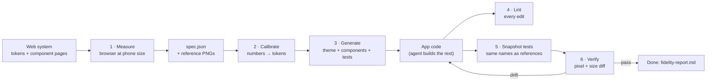

# Mobile migration: web design system → native apps, without losing fidelity

Read this when the design system has to ship on iOS, Android, Flutter, React Native, .NET MAUI or a web-in-native shell (Ionic, Capacitor, PWA).

## Contents
1. Why migrations drift
2. The fidelity contract: what stays the same, what adapts
3. How the migration works, step by step (with a worked example)
4. Workflow: the commands
5. Unit and type conversion
6. What the scaffold gives you per target
7. Anti-patterns the linter catches
8. Limits

## 1. Why migrations drift

Agents (and people) port a web system badly in six predictable ways:

| Cause | Symptom | Fix in this skill |
|---|---|---|
| Values re-guessed from memory | 15 px padding instead of 16, "close enough" grays | Native theme **generated** from tokens; screens use only theme names |
| CSS translated literally | hover styles, focus rings, px-based fonts | Platform idioms decided once in the generated components |
| States dropped | no pressed, disabled, loading or error states | Core components ship every state; `FIDELITY.md` checklist |
| Typography mismatched | different line height, text ignores Dynamic Type | Theme converts CSS line-height per platform; sizes scale with the user's setting |
| Icons swapped | SF Symbols / Material icons replace the DS set | `ds.py icons --platforms …` generates native icon components; lint flags foreign icons |
| Nobody measures | drift is found by users | `ds.py mobile verify` diffs native snapshots against web references |

The cure is **spec first, verify after**: the web system is measured into numbers and pictures, native code is generated from those numbers, and native output is compared back against the pictures.

## 2. The fidelity contract

**Never adapt** (identical to web):
- every color, spacing, radius, border width, type style and shadow (theme names only, no literals);
- anatomy, variants, states and their order of precedence (disabled > loading > error > pressed);
- copy, including error and empty-state text;
- icons (same set, same stroke, same size steps);
- accessibility semantics: names, roles, states, error text instead of color alone.

**Adapt on purpose** (platform idioms):

| Web | iOS (SwiftUI) | Android (Compose) | Flutter / RN |
|---|---|---|---|
| `:hover` | pressed state (`configuration.isPressed`) | `collectIsPressedAsState` | `onTapDown` / `Pressable({pressed})` |
| `:focus-visible` ring | system focus (keyboard, Switch Control) | focus indication | `Focus` / platform default |
| 24 px web target | **44 pt hit area**, visual size unchanged | **48 dp** (layout grows, Material rule) | 44/48 by platform; RN `hitSlop` |
| `<select>` / listbox | `Picker` / `Menu` | exposed dropdown / bottom sheet | platform picker / bottom sheet |
| modal dialog | `.sheet` | `ModalBottomSheet` / `Dialog` | modal bottom sheet |
| toast | top banner / overlay | `Snackbar` at bottom | platform position |
| tabs, nav bar, breadcrumbs | `TabView`, `NavigationStack` | `NavigationBar`, back stack | platform navigation |
| `rem` font sizes | Dynamic Type (`relativeTo:`) | `sp` (font scale) | `textScaler` / `allowFontScaling` |
| `prefers-reduced-motion` | `accessibilityReduceMotion` | animator duration scale | `disableAnimations` / `isReduceMotionEnabled` |
| `prefers-color-scheme`, high contrast | trait collection (dark, Increase Contrast) | `isSystemInDarkTheme()` | `platformBrightness` / `useColorScheme` |
| safe area | automatic | `WindowInsets` | `SafeArea` / `react-native-safe-area-context` |

Record any other deliberate adaptation as an ADR in `ds.config.json → decisions`.

## 3. How the migration works, step by step



The idea: **never let anyone (human or AI) re-type a design value**. Every number comes from the web system by measurement, every native file is generated from those numbers, and the result is compared with pictures of the web.

### Step 1 — Measure the web (`ds.py mobile spec`)
- ds.py resolves every token for every theme into absolute values: colors as RGBA, `rem` → px, typography roles with an **absolute** line height (CSS `1.5` × 16 px = 24 px), shadows split into layers, durations in ms, easing curves.
- If Node + Playwright are available, it starts the local docs server and opens each component page in Chromium at **390 × 844 px (a phone), 3× pixel density**, with animations and transitions switched off.
- For every demo on the page (`data-demo="state:unchecked"` …) and every theme (light, dark, high contrast) it finds the actual component (skipping wrappers like a tag list, using the block class from the CSS header, e.g. `.btn` for button) and reads what the browser **computed**: width, height, padding, gap, border, radius, background, text color, font, size, weight, line height, min-height, the visible text, and the same for the form control inside (the `<input>` of a checkbox).
- Inline components (badge, tag, button) are measured at their natural width, not stretched by the docs grid.
- Each demo is screenshotted to `dist/mobile/reference/<file>--<demo>--<theme>.png`. These PNGs are the ground truth.

### Step 2 — Calibrate: turn measurements back into tokens
For each core component a small recipe says which measurement feeds which property (e.g. checkbox `size` ← the control's width). Then:
- a measured value that equals a token is written **as that token** (24 px → `icon.size.lg`), so the native code stays themeable;
- a value no token has is kept as a literal and **flagged** in `FIDELITY.md`, so you can add a token or fix the web;
- nothing measured → the default token is used and the report says "not measured";
- colors: if the web paints a component with a different token than the expected role (the badge uses `bg.subtle`, not `bg.muted`), the generated code follows the web. A candidate must match in **every** theme, so a coincidence (white = white) doesn't count.

### Step 3 — Generate (`ds.py mobile scaffold`)
- **Theme file** per platform, with platform-correct conversions (section 5): colors per theme (iOS resolves light / dark / Increase Contrast at runtime), type styles that keep the CSS line height and still follow Dynamic Type / font scale, shadows, motion, a 44 pt / 48 dp touch-target constant.
- **10 core components** from templates in which every value is a theme name. States are built in: pressed replaces hover, disabled, loading, error text. Touch targets grow the **hit area** to 44/48 while the visible box keeps the web size (iOS `contentShape`, Android a layout modifier that snapshot tests can turn off, React Native `hitSlop`).
- **Snapshot tests** that render each component with the same copy, width and theme as the web demo, at 3×, and save it with the **same file name** as the reference.
- **Icons** from the system sprite as native components (`references/icons.md`), so nobody substitutes SF Symbols or Material icons.
- **`FIDELITY.md`**: where every number came from, color checks, and the adaptation checklist.

### Step 4 — Lint while building (`ds.py mobile lint` + hook)
The agent builds the remaining screens and components from `spec.json`. Each Swift / Kotlin / Dart / TSX edit is checked for the classic drift: literal colors, numeric padding/radius, fixed font sizes, hover handlers, targets under 44/48, foreign icons. With `--out`, the scaffold drops `.ds-mobile.json` in the app, and the Claude Code hook reports problems right after each edit.

### Step 5 — Verify (`ds.py mobile verify`)
- Each native snapshot is matched to its reference by name (prefixes added by snapshot tools, like `testCore.`, are ignored).
- Sizes are compared first (default ±3 %): a wrong padding or font shows up here.
- Then pixels: the native image is scaled to the reference size and every pixel pair is compared in **OKLab**, a color space where distance ≈ perceived difference. Pixels with ΔE > 3 count as drift; more than 1 % drifting pixels fails (both thresholds adjustable).
- Failures produce `dist/mobile/diff/<name>.png` (drifting pixels in red over a faded reference) and a row in `fidelity-report.md`; the command exits 1, so CI can gate on it. Fix and repeat until it passes.
- Optional `--measurements`: native tests can dump their own numbers (width, radius, colors…) and ds.py compares them with the spec within ±1 px.

### Worked example: the Fleetline checkbox
1. **Measured** (light theme, `state:unchecked`): control 24 × 24 px, radius 4, border 2 px `rgb(100,116,139)`, gap 12, label "Tyres checked for wear and pressure".
2. **Calibrated:** 24 → `icon.size.lg`, 4 → `radius.sm`, 2 → `border.width.thick`, 12 → `space.3`, border color = `input.border`. The template defaults were 20 px and a 1 px border; without measuring, the port would have been visibly lighter and smaller.
3. **Generated** (SwiftUI):
   ```swift
   RoundedRectangle(cornerRadius: DSDimension.radiusSm)
       .strokeBorder(on ? DSColor.actionPrimaryBg : DSColor.inputBorder, lineWidth: DSDimension.borderWidthThick)
   // …
   .frame(width: DSDimension.iconSizeLg, height: DSDimension.iconSizeLg)
   ```
   `FIDELITY.md` records: `checkbox | size | 24 | web measurement → icon.size.lg`.
4. **Tested:** `DSSnapshotTests` renders `Toggle("Tyres checked for wear and pressure", …).toggleStyle(DSCheckboxStyle())` at the web width as `checkbox--state_unchecked--light.png`.
5. **Verified:** `ds.py mobile verify` compares it with `dist/mobile/reference/checkbox--state_unchecked--light.png`; if someone later hard-codes `lineWidth: 1`, the size and pixel diff fail and the linter flags the edit.

## 4. Workflow: the commands

```bash
ds.py playwright <ds> && (cd <ds> && npm install && npx playwright install chromium)   # once, for measurement
ds.py mobile spec <ds>                    # tokens per theme + measured boxes + reference PNGs (@3x, 390 px wide)
ds.py icons <svg-dir> <ds> --platforms all   # if the system has icons (see references/icons.md)
ds.py mobile scaffold <ds> --target swiftui,compose,flutter,react-native,maui,web-mobile   # or all; --out <app path>
```

1. **Spec.** `dist/mobile/spec.json` has `tokens.<theme>` (colors as RGBA 0–1, dimensions in px = pt = dp, typography with absolute line height, shadows as layers, durations in ms, cubic-bezier easings) and `components.<file>.<demo>.<theme>` (computed width, height, padding, gap, border, radius, colors, font, line height, min-height, visible text, and the same for the first form control inside). Reference PNGs: `dist/mobile/reference/<file>--<demo>--<theme>.png`. `--tokens-only` skips the browser; `--only button,card` limits the files.
2. **Scaffold.** Per target: a theme file (all semantic colors per theme, dimensions, opacity, motion, type roles, elevation), 10 core components (Button with variants × sizes × pressed/disabled/loading, TextField, Checkbox, Switch, Card, Badge, Alert, Avatar, Tag, Divider), a snapshot test that renders each at the reference size with the reference name and copy, and `FIDELITY.md`. Measured values win over default tokens: a measured 12 px padding becomes `space.3`; a value no token has is emitted as a literal and flagged. Measured colors that differ from the default role switch to the token the web really uses.
3. **Build the rest from the spec.** For every other component the app needs, read its entry in `spec.json`, use only theme names, copy the patterns in the generated core components (pressed state, hit area, half-leading text), and add a snapshot test with the same naming.
4. **Lint.** `ds.py mobile lint <app src> --strict`. With `--out`, the scaffold drops `.ds-mobile.json` into the app so the PostToolUse hook lints every native edit automatically.
5. **Verify.** Run the snapshot tests, then `ds.py mobile verify <ds> --native <png folder>` (tool name prefixes such as `testX.` are ignored). It writes `dist/mobile/fidelity-report.md` and `dist/mobile/diff/*.png` (red = drifting pixels) and exits 1 above `--max-diff` (default 1 % of pixels over OKLab ΔE 3) or `--size-tolerance` (default 3 %). `--measurements m.json` also compares numbers dumped by native tests (`{file: {demo: {theme: {width, height, radius, fontSize, background…}}}}`) with ±1 px tolerances. Loop until it passes.

Fonts must be the real ones on both sides (bundle the DS fonts in the app and load them in golden tests), or text pixels will drift even when the layout is right.

## 5. Conversion

| Token | SwiftUI | Compose | Flutter | React Native |
|---|---|---|---|---|
| 1 CSS px | 1 pt | 1 dp | 1 logical px | 1 dp |
| font size | `.custom(f, size:, relativeTo:)` | `sp` | `fontSize` × `textScaler` | `fontSize` (scales by default) |
| line height (CSS, half-leading) | `lineSpacing(extra)` + `padding(.vertical, extra/2)` | `lineHeight` sp + `LineHeightStyle(Center, Trim.None)` | `height: lh/size` + `TextLeadingDistribution.even` | `lineHeight` (absolute) |
| color | `UIColor` resolved per trait (light/dark/contrast) | `Color(0xAARRGGBB)` per theme | `Color(0xAARRGGBB)` per theme | `#RRGGBB(AA)` per theme |
| box-shadow | `.shadow(radius: blur/2)`, no spread | elevation ≈ blur/2 dp | `BoxShadow` with blur sigma matched to CSS | `boxShadow` string (RN 0.76+, New Architecture) |
| duration / easing | `.timingCurve(…, duration:)` | `tween` + `CubicBezierEasing` | `Duration` + `Cubic` | ms + `Easing.bezier` |

## 6. What the scaffold gives you per target

| Target | Files | Needs |
|---|---|---|
| `swiftui` | `DSTheme.swift`, `DSComponents.swift`, `Tests/DSSnapshotTests.swift`, `icons/` (asset catalog + `DSIcon`) | iOS 16+, swift-snapshot-testing for tests |
| `compose` | `DsTheme.kt`, `DsComponents.kt`, `test/DsSnapshotTest.kt`, `icons/` (`DsIcons` ImageVectors + VectorDrawables) | compose-foundation (+ material3 for the spinner), Roborazzi + Robolectric for tests; `--package` sets the Kotlin package |
| `flutter` | `ds_theme.dart`, `ds_components.dart`, `test/ds_golden_test.dart`, `icons/ds_icons.dart` | Flutter 3.10+ (Dart 3), flutter_svg for icons |
| `react-native` | `theme.ts`, `DsComponents.tsx`, `DsSnapshots.tsx` (dev capture screen), `icons/DsIcon.tsx` | react-native-svg; react-native-view-shot for capture; Expo works |
| `maui` | `DsTokens.xaml` (colors light/dark, doubles, label styles) | resources only — build controls from the spec |
| `web-mobile` | `web-mobile.css` (safe areas, 44 px targets on coarse pointers, 16 px inputs, no tap highlight) | load after `dist/ds.css` in Ionic/Capacitor/PWA |

UIKit and Android Views: use `ds.py export --target ios|android` (`references/adapters.md`) for colors and dimensions, and the spec for everything else.

## 7. Anti-patterns (`ds.py mobile lint`)

| Platform | Flags |
|---|---|
| Swift | `Color(red:…)`, hex/literal colors, `.font(.system(size:))`, numeric `.padding(…)`, numeric `cornerRadius:`, `.onHover`, `.frame(height: <44)`, `Image(systemName:)` |
| Kotlin | `Color(0xFF…)`, `Color.Red`…, `fontSize = 14`, `.padding(16.dp)`, `RoundedCornerShape(8.dp)`, `Icons.Default.*`, hover handlers, `.height(<48.dp)` |
| Dart | `Color(0x…)`, `Colors.red`, `fontSize: 14`, numeric `EdgeInsets`, `BorderRadius.circular(8)`, `Icons.*`/`CupertinoIcons.*`, `onHover:` |
| TS/TSX | `'#fff'`/`rgba(`, `fontSize: 14`, numeric padding/margin/radius, `react-native-vector-icons`/`@expo/vector-icons`, `onHoverIn` |

Theme and icon files are exempt. Silence a deliberate exception with a `ds-lint: ignore` comment on that line, and say why.

## 8. Limits
- Measurement needs Node + Playwright; without them the scaffold uses token defaults and `FIDELITY.md` says so.
- The 10 core components are generated; the rest of the catalog is built by the agent from the spec (the scaffold is the pattern, not the whole library).
- Snapshot pixels depend on fonts and OS text rendering: compare on a fixed simulator/emulator image, raise `--max-diff` slightly for text-heavy components, and keep `--size-tolerance` strict.
- CI compiles the generated code on real SDKs (Swift/iOS SDK, Compose/Gradle, Flutter analyze + golden run, RN `tsc --strict`); it does not run device snapshots.
